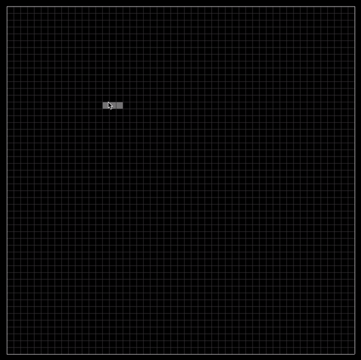

# Argon
A simple & lightweight wrapper for SDL2 that provides a clean and easy API, allowing you to create shorter graphical projects in c++. 

## Getting Started / Installation
- Ensure [SDL2](https://www.libsdl.org/download-2.0.php) is installed
- Add [Argon.h](src/Argon.h) to your source directory
- Add `#include "Argon.h"` somewhere in your source code
- Ensure you are linking to SDL2 using `-lSDL2`

This wrapper also wraps some SDL_GFX functions and SDL_TTF functions to use these add `#define ARGON_INCLUDE_GFX` and/or `#define ARGON_INCLUDE_TTF` before your `#include "Argon.h"` line.


### Basic Usage

Argon is a class that can be extended, you then have full access to the API. View examples for more details.
```C++
#include "Argon.h"

struct MyApp : public Argon {

	// Required sets up  settings for creating the window when begin() is called
	MyApp() : Argon("App Title", 800, 800, ARGON_RESIZABLE|ARGON_HIGHDPI|ARGON_VSYNC) {}

	void gameLoop(double dt) {
		// Runs once per frame (dt is the deltaTime between now and the last frame in seconds)

		// Some convenient getters (see API section for all getters)
		// mx() mouse x position
		// my() mouse y position
		// mouseDown() returns true if mouse is down
		// mWhich() returns which button is pressed (or last pressed)
		// wx() current window x position
		// wy() current window y position
		// ww() current window width
		// wh() current window height
		

		// Check API for auto handling of resizable textures & more
	}

	// Event Listeners for you to overload...
	void onQuit(const Event event) {}
	void onLoad(const WindowEvent event) {}
	void onUnload(const WindowEvent event) {}
	void onMouseDown(const MouseButtonEvent event) {}
	void onMouseUp(const MouseButtonEvent event) {}
	void onMouseMove(const  MouseEvent event) {}
	void onMouseWheel(const WheelEvent event) {}
	void onKeyDown(const KeyEvent event) {}
	void onKeyUp(const KeyEvent event) {}
	void onWindowShow(const WindowEvent event) {}
	void onWindowExpose(const WindowEvent event) {}
	void onWindowMove(const WindowEvent event) {}
	void onWindowResize(const WindowEvent event) {}
	void onWindowMinimize(const WindowEvent event) {}
	void onWindowMaximize(const WindowEvent event) {}
	void onWindowRestore(const WindowEvent event) {}
	void onMouseEnter(const MouseEvent event) {}
	void onMouseLeave(const MouseEvent event) {}
	void onWindowFocus(const WindowEvent event) {}
	void onWindowBlur(const WindowEvent event) {}
	void onWindowClose(const WindowEvent event) {}
	void onWindowTakeFocus(const WindowEvent event) {}
	void onWindowHitTest(const WindowEvent event) {}
	void onFileDrop(const FileDropEvent event) {}
};

int main(int argc, char** argv) {
	MyApp app;
	app.begin();
	return 0;
}
```

## Examples
All of the examples in the [examples](examples) folder have comments at the top to explain how to compile and run them

#### [Conways Game of Life](examples/conways.cpp)
https://en.wikipedia.org/wiki/Conway%27s_Game_of_Life



#### [Abelian Sandpile Simulation](examples/sandpiles.cpp)
https://en.wikipedia.org/wiki/Abelian_sandpile_model


#### [Fractal Simulation (Mandelbrot & Julia)](examples/fractal.cpp)
https://en.wikipedia.org/wiki/Mandelbrot_set
https://en.wikipedia.org/wiki/Julia_set


## API

### Constructors
The constructor sets up all of the settings for the project. Use `begin()` to actually create the window. 

#### Variations
```C++
Argon(const char* title, int32_t x, int32_t y, int32_t w, int32_t h, uint16_t flags);
Argon(const char* title, int32_t w, int32_t h, uint16_t flags);
Argon(const char* title, int32_t w, int32_t h);
Argon(const char* title, uint16_t flags);
Argon(const char* title);
Argon();
```
#### Arguments
`title` the title of the window argon creates. Defaults to "Argon".
`x` the x position of the window. Defaults to SDL_WINDOWPOS_UNDEFINED.
`y` the y position of the window. Defaults to SDL_WINDOWPOS_UNDEFINED.
`w` the width of the window. Defaults to 500.
`h` the height of the window. Defaults to 500.
`flags` bitfield options created by performing the 'or' operation on the following flags. Defaults to ARGON_VSYNC|ARGON_RESIZABLE|ARGON_HIGHDPI.
- `ARGON_FULLSCREEN` start in full screen mode
- `ARGON_HIDDEN` start with window hidden
- `ARGON_BORDERLESS` do not show border on window (if enabled)
- `ARGON_RESIZABLE` allow window to be resizable
- `ARGON_MINIMIZED` start with window minimized
- `ARGON_MAXIMIZED` start with window maximized
- `ARGON_HIGHDPI` use high dpi mode for better resolutions
- `ARGON_ON_TOP` force window to always appear on top of others
- `ARGON_NO_TASKBAR` hide taskbar
- `ARGON_MOUSE_CAPTURE` do not show mouse (like in most video games)
- `ARGON_VSYNC` enable vertical synchronization

### General Functions
`void begin()` create the window and allow all Argon functionality  
`void stop()` destroy the window and stop all Argon functionality  
`void maximize()` maximize window  
`void minimize()` minimize window  
`void show()` show window  
`void hide()` hide window  
`void raise()` raise window  
`void restore() ` restore window  
`void fullscreen()` put window into full screen mode  
`void setMaxSize(int w, int h)` set maximum window size  
`void setMinSize(int w, int h)` set minimum window size  
`void setOpacity(float opacity)` set window opacity  
`void setPosition(int x, int y)` set window position  
`void setMousePosition(int x, int y)` set mouse position  
`void setSize(int w, int h)` set window size  
`void setTitle(const char* title)` set window title  
`void setIsResizable(bool val)` enable or disable window resizability   
`void setBordered(bool val)` enable or disable window borders  
`void setBrightness(float brightness)` set brightness of windows  
`bool setCaptureMouse(bool capture = true)` enable or disable capturing of the mouse  
`bool setRelativeMouseMode(bool val)` enable relative mouse mode (mouse movements described in offsets, see `rx` and `ry` in `MouseEvent`)  
`void setCursorDisplay(bool show)` show or hide the cursor  
`bool alert(const char* message)` trigger a native alert with the message  
`bool alert(const char* title, const char* message)`  trigger a native alert with the message and title  
`int alert(const char* title, const char* message, uint8_t numButtons, SDL_MessageBoxButtonData* btnData, SDL_MessageBoxFlags flag = SDL_MESSAGEBOX_INFORMATION)` trigger a native alert with the message and buttons. See [SDL_ShowMessageBox](https://wiki.libsdl.org/SDL_ShowMessageBox)

### Event Handlers
This is a list of functions that you can overload to handle events. You don't need to overload every function, Argon will call these functions for you and provide you with a structure of useful data. View the Event structures below to understand what information is provided to you when these handlers are called by Argon.

#### Event Handler Basic Usage
```C++
#include "Argon.h"

struct MyApp : public Argon {

	// Required sets up  settings for creating the window when begin() is called
	MyApp() : Argon("App Title", 800, 800, ARGON_RESIZABLE|ARGON_HIGHDPI|ARGON_VSYNC) {}

	void gameLoop(double dt) {
		// Runs once per frame (dt is the deltaTime between now and the last frame in seconds)
	}
	void onQuit(const Event event) {/* handle event here */}
	void onLoad(const WindowEvent event) {/* handle event here */}
	void onUnload(const WindowEvent event) {/* handle event here */}
	void onMouseDown(const MouseButtonEvent event) {/* handle event here */}
	void onMouseUp(const MouseButtonEvent event) {/* handle event here */}
	void onMouseMove(const  MouseEvent event) {/* handle event here */}
	void onMouseWheel(const WheelEvent event) {/* handle event here */}
	void onKeyDown(const KeyEvent event) {/* handle event here */}
	void onKeyUp(const KeyEvent event) {/* handle event here */}
	void onWindowShow(const WindowEvent event) {/* handle event here */}
	void onWindowExpose(const WindowEvent event) {/* handle event here */}
	void onWindowMove(const WindowEvent event) {/* handle event here */}
	void onWindowResize(const WindowEvent event) {/* handle event here */}
	void onWindowMinimize(const WindowEvent event) {/* handle event here */}
	void onWindowMaximize(const WindowEvent event) {/* handle event here */}
	void onWindowRestore(const WindowEvent event) {/* handle event here */}
	void onMouseEnter(const MouseEvent event) {/* handle event here */}
	void onMouseLeave(const MouseEvent event) {/* handle event here */}
	void onWindowFocus(const WindowEvent event) {/* handle event here */}
	void onWindowBlur(const WindowEvent event) {/* handle event here */}
	void onWindowClose(const WindowEvent event) {/* handle event here */}
	void onWindowTakeFocus(const WindowEvent event) {/* handle event here */}
	void onWindowHitTest(const WindowEvent event) {/* handle event here */}
	void onFileDrop(const FileDropEvent event) {/* handle event here */}
};

int main(int argc, char** argv) {
	MyApp app;
	app.begin();
	return 0;
}
```

#### Event Handler List
`void gameLoop(double deltaTime)` run every frame (provides deltaTime which is the time since last frame in seconds)  
`void onQuit(const Event event)` run before the app is quit  
`void onLoad(const WindowEvent event)` run when the app is loaded after begin() is called but before the game loop starts  
`void onUnload(const WindowEvent event)` run at the very end of the application. Usually after a quit event.  
`void onMouseDown(const MouseButtonEvent event)` run when a mouse button is pressed  
`void onMouseUp(const MouseButtonEvent event)` run when a mouse button is released  
`void onMouseMove(const  MouseEvent event)` run when the mouse is moved over the window  
`void onMouseWheel(const WheelEvent event)` run when the mouse wheel is scrolled  
`void onKeyDown(const KeyEvent event)` run when a key is held down (including repeat calls, see KeyEvent)  
`void onKeyUp(const KeyEvent event)` run when a key is released  
`void onWindowShow(const WindowEvent event)` run when a window is shown  
`void onWindowExpose(const WindowEvent event)` run when a window is exposed  
`void onWindowMove(const WindowEvent event)` run when a window is moved  
`void onWindowResize(const WindowEvent event)` run when a window is resized  
`void onWindowMinimize(const WindowEvent event)` run when a window is minimized  
`void onWindowMaximize(const WindowEvent event)` run when a window is maximized  
`void onWindowRestore(const WindowEvent event)` run when a window is restored  
`void onMouseEnter(const MouseEvent event)` run when the mouse enters the window  
`void onMouseLeave(const MouseEvent event)` run when the mouse leaves the window  
`void onWindowFocus(const WindowEvent event)` run when the window receives focus  
`void onWindowBlur(const WindowEvent event)` run when the window loses focus  
`void onWindowClose(const WindowEvent event)` run when the window is closed  
`void onWindowTakeFocus(const WindowEvent event)` run when the window takes focus from another window  
`void onWindowHitTest(const WindowEvent event)` run when a hit test is performed  
`void onFileDrop(const FileDropEvent event)` run when a file is dropped on the window (limited support)  

#### Event Structures
```C++
struct Event {
	uint32_t timestamp; //time event occurred corresponding to SDL_Event.timestamp
};
struct WindowEvent : Event {
	uint16_t x; // x position of window at time of event
	uint16_t y; // y position of window at time of event
	uint16_t w; // width of window at time of event
	uint16_t h; // height of window at time of event
};
struct KeyEvent : Event {
	SDL_Scancode scancode; // SDL scancode of key that is pressed
	SDL_Keycode keycode; // SDL keycode of key that is pressed
	bool repeat; // true if this is a repeat call (occurs when holding down a key)
	struct {
		bool none     : 1; // true if no key modifiers are pressed
		bool shift    : 1; // true if any shift key is pressed
		bool lshift   : 1; // true if left shift key is pressed
		bool rshift   : 1; // true if right shift key is pressed
		bool ctrl     : 1; // true if any ctrl key is pressed
		bool lctrl    : 1; // true if left ctrl key is pressed
		bool rctrl    : 1; // true if right ctrl key is pressed
		bool alt      : 1; // true if any alt key is pressed
		bool lalt     : 1; // true if left alt key is pressed
		bool ralt     : 1; // true if right alt key is pressed
		bool meta     : 1; // true if any meta (windows key or cmd key) key is pressed
		bool lmeta    : 1; // true if left meta (windows key or cmd key) key is pressed
		bool rmeta    : 1; // true if right meta (windows key or cmd key) key is pressed
		bool capslock : 1; // true if capslock is on
		bool numlock  : 1; // true if numlock is on
		bool altgr    : 1; // true if the altgr (https://en.wikipedia.org/wiki/AltGr_key) key is pressed
	} mod; // a list of key modifier states accessed using event.mod.<value>
};
struct MouseEvent : Event {
	uint16_t x; // x position of the mouse at time of event
	uint16_t y; // y position of the mouse at time of event
	int16_t rx; // relative change in x position 
	int16_t ry; // releative change in y position
	bool down; // true if any mouse button is pressed down at time of event
};
struct MouseButtonEvent : Event {
	uint16_t x; // x position of click at time of event
	uint16_t y; // y position of click at time of event
	uint8_t which; // indicates which button was pressed
	uint8_t clicks; // number of clicks that have occurred in a row (useful for detecting double click)
};
struct WheelEvent : Event {
	int32_t dx; // amount scrolled in the x direction
	int32_t dy; // amount scrolled in the y direction
	bool down; // true if mouse is down at time of event
	bool flipped; // true if direction = SDL_MOUSEWHEEL_FLIPPED
};
struct FileDropEvent : Event {
	char* path; // absolute path of the file dropped on the window
};
```

### Getters
`bool isRunning()` returns true if the Argon gameloop is still looping  
`int32_t wx()` returns the window x position  
`int32_t wy()` returns the window y position  
`int32_t ww()` returns the window width  
`int32_t wh()` returns the window height  
`int32_t mx()` returns the mouse x position  
`int32_t my()` returns the window y position  
`bool mouseDown()` returns true if a mouse button is pressed down  
`uint8_t mWhich()` identifies which mouse button is pressed (or if mouseDown() returns false this returns the id of the last mouse button pressed). Corresponds to `button` in [SDL_MouseButtonEvent](https://wiki.libsdl.org/SDL_MouseButtonEvent).  
`bool getBorderSizes(int* top, int* right, int* bottom, int* left)` stores border sizes in the appropriate pointers passed as arguments. Same as [SDL_GetWindowBordersSize](https://wiki.libsdl.org/SDL_GetWindowBordersSize). Returns true if successful.  
`float getBrightness()` returns the brightness where 0 is dark and 1 is full brightness. Corresponds to [SDL_GetWindowBrightness](https://wiki.libsdl.org/SDL_GetWindowBrightness)  
`void getMaxSize(int* w, int* h)` stores the max window width and height in the values pointed to by the parameters  
`void getMinSize(int* w, int* h)`stores the min window width and height in the values pointed to by the parameters  
`float getOpacity()` returns the opacity of the window between 0 and 1  
`const char* getTitle()` returns the current window title  
`bool isAntiAliasing()` returns true if anti aliasing is enabled (only matters if using SDL_GFX see below). Not all shapes can be anti-aliased, Argon will do its best.

### Setters
`void setAntiAlias(bool val)` sets if anti aliasing for SDL_GFX should be on  
`void setBackground(uint32_t color)` sets the background color (what screen is refreshed to after each frame render)  
`void setBackground(uint8_t r, uint8_t g, uint8_t b, uint8_t a = 255)` sets the background color (what screen is refreshed to after each frame render)  

### Texture Handling
A `Texture` is an Argon wrapper for `SDL_Texture`. The main difference being that Argon will handle resizing the texture when appropriate. Argon will also cleanup all textures on quit but they can be explicitly destroyed (see api below).  

#### Basic Texture Usage
```C++
#include "Argon.h"

struct MyApp : public Argon {

	Texture* texture = NULL;

	// Required sets up  settings for creating the window when begin() is called
	MyApp() : Argon("App Title", 800, 800, ARGON_RESIZABLE|ARGON_HIGHDPI|ARGON_VSYNC) {}

	void onLoad(WindowEvent event) {
		// Create a texture inn the onLoad function (could also create elsewhere)
		texture = createTexture();
	}
	void gameLoop(double dt) {
		int32_t w, h;
		uint8_t* pixels = lockTexture(texture, &w, &h);
		// !!! ALWAYS ENSURE THAT PIXELS IS NOT NULL OTHERWISE YOUR PROGRAM MAY CRASH
		if(pixels != NULL) {
			// You can edit values of pixels in here. The fomat is SDL_PIXELFORMAT_RGBA32.
			// Do not go outside the bounds of wxh
			// Always use the w & h returned from lockTexture not any other value like ww() or wh()

			// !!! ALWAYS UNLOCK TEXTURE ASAP AFTER DONE EDITING VALUES
			unlockTexture(texture);
		}


		// Draw texture to window if desired (or you could save for later if you don't want to draw right away) 
		drawTexture(texture);
	}
};

int main(int argc, char** argv) {
	MyApp app;
	app.begin();
	return 0;
}
```

#### Texture API
`Texture* createTexture()` create a SDL_Texture with SDL_PIXELFORMAT_RGBA32 and SDL_TEXTUREACCESS_STREAMING. The texture is the size of ww() and wh() and will be resized when necessary. Returns a pointer to the Argon managed texture.  
`bool destroyTexture(Texture*)` destroys the Texture and tells Argon to stop managing it. Use this instead of SDL_Texture_Destroy when using `Texture*` instead of `SDL_Texture`.  
`void destroyAllTextures()` clean up all Argon managed Textures. Any attempt to use textures after destruction will crash the program.  
`uint8_t* lockTexture(Texture* texture, int32_t* w, int32_t* h)` necessary call used to modify pixel values in the texture. Returns a pointer to the pixel data of the texture, ENSURE THAT THIS POINTER IS NOT NULL BEFORE MODIFYING. Also stores the width and height of the texture in the passed arguments. Use this width/height instead of ww() or wh() to stay within memory bounds.  
`void getTextureSize(Texture* texture, int32_t* w, int32_t* h)` get the size of the passed texture and store it in w & h parameters  
`void unlockTexture(Texture* texture)` must be called after you are done modifying pixel values using lockTexture  
`void drawTexture(Texture* texture)` render the texture to the screen  


### Basic Graphics
`void clear()` set the entire screen to the set background color  
`void pixel(int32_t x, int32_t y, uint8_t r, uint8_t g, uint8_t b, uint8_t a = 255)`  
`void pixel(int32_t x, int32_t y, uint32_t color = 0xFFFFFFFF)` draw a pixel to the screen with the given color. For mass pixel manipulation look into the texture api.  
`void fillRect(int32_t x, int32_t y, uint16_t w, uint16_t h, uint8_t r, uint8_t g, uint8_t b, uint8_t a = 255)`  
`void fillRect(int32_t x, int32_t y, uint16_t w, uint16_t h, uint32_t color = 0xFFFFFFFF)` draw a filled rectangle on the screen with the given color
`void rect(int32_t x, int32_t y, uint16_t w, uint16_t h, uint8_t r, uint8_t g, uint8_t b, uint8_t a = 255)`  
`void rect(int32_t x, int32_t y, uint16_t w, uint16_t h, uint32_t color = 0xFFFFFFFF)` draw a rectangle outline on the screen with the given color
`void line(int32_t x1, int32_t y1, int32_t x2, int32_t y2, uint8_t r, uint8_t g, uint8_t b, uint8_t a = 255)`  
`void line(int32_t x1, int32_t y1, int32_t x2, int32_t y2, uint32_t color = 0xFFFFFFFF)`  draw a line between two points with the given color
`void hline(int32_t x1, int32_t x2, int32_t y, uint8_t r, uint8_t g, uint8_t b, uint8_t a = 255)`  
`void hline(int32_t x1, int32_t x2, int32_t y, uint32_t color = 0xFFFFFFFF)`  draw a horizontal line between two x values at the y position with the given color
`void vline(int32_t x, int32_t y1, int32_t y2, uint8_t r, uint8_t g, uint8_t b, uint8_t a = 255)`  
`void vline(int32_t x, int32_t y1, int32_t y2, uint32_t color = 0xFFFFFFFF)`  draw a vertical line between two y values at the x position with the given color

### Extra Graphics
To use the following functions you must add have [SDL_GFX](https://www.ferzkopp.net/wordpress/2016/01/02/sdl_gfx-sdl2_gfx/) installed and add `-lSDL2_gfx` to your compile command. To gain access to the following API add a `#define ARGON_INCLUDE_GFX` before `#include "Argon.h"`  

`void roundedRectangle(int32_t x, int32_t y, uint16_t w, uint16_t h, uint16_t radius, uint8_t r, uint8_t g, uint8_t b, uint8_t a = 255)`  
`void roundedRectangle(int32_t x, int32_t y, uint16_t w, uint16_t h, uint16_t radius, uint32_t color = 0xFFFFFFFF)` draw a rectangle outline with a border radius defined by radius  
`void fillRoundedRectangle(int32_t x, int32_t y, uint16_t w, uint16_t h, uint16_t radius, uint8_t r, uint8_t g, uint8_t b, uint8_t a = 255)`  
`void fillRoundedRectangle(int32_t x, int32_t y, uint16_t w, uint16_t h, uint16_t radius, uint32_t color = 0xFFFFFFFF)` draw a filled rectangle with a border radius defined by radius  
`void thickLine(int32_t x1, int32_t y1, int32_t x2, int32_t y2, uint8_t thickness, uint8_t r, uint8_t g, uint8_t b, uint8_t a = 255)`  
`void thickLine(int32_t x1, int32_t y1, int32_t x2, int32_t y2, uint8_t thickness, uint32_t color = 0xFFFFFFFF)` draw a line with a given thickness  
`void circle(int32_t x, int32_t y, uint16_t radius, uint8_t r, uint8_t g, uint8_t b, uint8_t a = 255)`  
`void circle(int32_t x, int32_t y, uint16_t radius, uint32_t color = 0xFFFFFFFF)` draw a circle outline defined by center coordinates and a radius  
`void fillCircle(int32_t x, int32_t y, uint16_t radius, uint8_t r, uint8_t g, uint8_t b, uint8_t a = 255)`  
`void fillCircle(int32_t x, int32_t y, uint16_t radius, uint32_t color = 0xFFFFFFFF)` draw a filled circle defined by center coordinates and a radius  
`void ellipse(int32_t x, int32_t y, uint16_t rx, uint16_t ry, uint8_t r, uint8_t g, uint8_t b, uint8_t a = 255)`  
`void ellipse(int32_t x, int32_t y, uint16_t rx, uint16_t ry, uint32_t color = 0xFFFFFFFF)` draw a ellipse outline defined by center point and radii  
`void fillEllipse(int32_t x, int32_t y, uint16_t rx, uint16_t ry, uint8_t r, uint8_t g, uint8_t b, uint8_t a = 255)`  
`void fillEllipse(int32_t x, int32_t y, uint16_t rx, uint16_t ry, uint32_t color = 0xFFFFFFFF)` draw a filled ellipse define by center point and radii  
`void arc(int32_t x, int32_t y, uint16_t radius, int16_t start, int16_t end, uint8_t r, uint8_t g, uint8_t b, uint8_t a = 255)`  
`void arc(int32_t x, int32_t y, uint16_t radius, int16_t start, int16_t end, uint32_t color = 0xFFFFFFFF)` draw a segment of a circle defined by center point, radius, and start/end angles in radians  
`void triangle(int32_t x1, int32_t y1, int32_t x2, int32_t y2, int32_t x3, int32_t y3, uint8_t r, uint8_t g, uint8_t b, uint8_t a = 255)`  
`void triangle(int32_t x1, int32_t y1, int32_t x2, int32_t y2, int32_t x3, int32_t y3, uint32_t color = 0xFFFFFFFF)` draw a triangle outline defined by 3 points  
`void fillTriangle(int32_t x1, int32_t y1, int32_t x2, int32_t y2, int32_t x3, int32_t y3, uint8_t r, uint8_t g, uint8_t b, uint8_t a = 255)`  
`void fillTriangle(int32_t x1, int32_t y1, int32_t x2, int32_t y2, int32_t x3, int32_t y3, uint32_t color = 0xFFFFFFFF)` draw a filled triangle defined by 3 points  
`void polygon(uint8_t numPts, const int16_t* x, const int16_t* y, uint8_t r, uint8_t g, uint8_t b, uint8_t a = 255)`  
`void polygon(uint8_t numPts, const int16_t* x, const int16_t* y, uint32_t color = 0xFFFFFFFF)` draw a polygon outline defined by a list of x coordinates and a list of y coordinates  
`void fillPolygon(uint8_t numPts, const int16_t* x, const int16_t* y, uint8_t r, uint8_t g, uint8_t b, uint8_t a = 255)`  
`void fillPolygon(uint8_t numPts, const int16_t* x, const int16_t* y, uint32_t color = 0xFFFFFFFF)` draw a filled polygon defined by a list of x coordinates and a list of y coordinates  

### Font API
To use the font API you must have [SDL_TTF](https://www.libsdl.org/projects/old/SDL_ttf/) installed and add `-lSDL2_ttf` to your compile command. To gain access to the following API add a `#define ARGON_INCLUDE_TTF` before `#include "Argon.h"`  

`Font* createFont(const char* fontFile, uint16_t fontSize)` create a font object. you must free this font your self at some point using `freeFont(Font* font)`  
`void freeFont(Font* font)` clean up the memory associated with this font  
`void string(const char* txt, Font* font, int32_t x, int32_t y, uint8_t r, uint8_t g, uint8_t b, uint8_t a = 255)`  
`void string(const char* txt, Font* font, int32_t x, int32_t y, uint32_t color = 0xFFFFFFFF)` draw a string of text to the window using the given font at the position x y  
`void stringDimensions(const char* string, Font* font, int* w, int* h)` get the dimensions of a string using a given font, store the width and height of that string in w & h respectively. Useful for centering text.  


## Authors
  - **Owen Kuhn** - *Development* -
    [Github](https://github.com/OwenK2)


## License
This project is licensed under the [MIT License](LICENSE)

